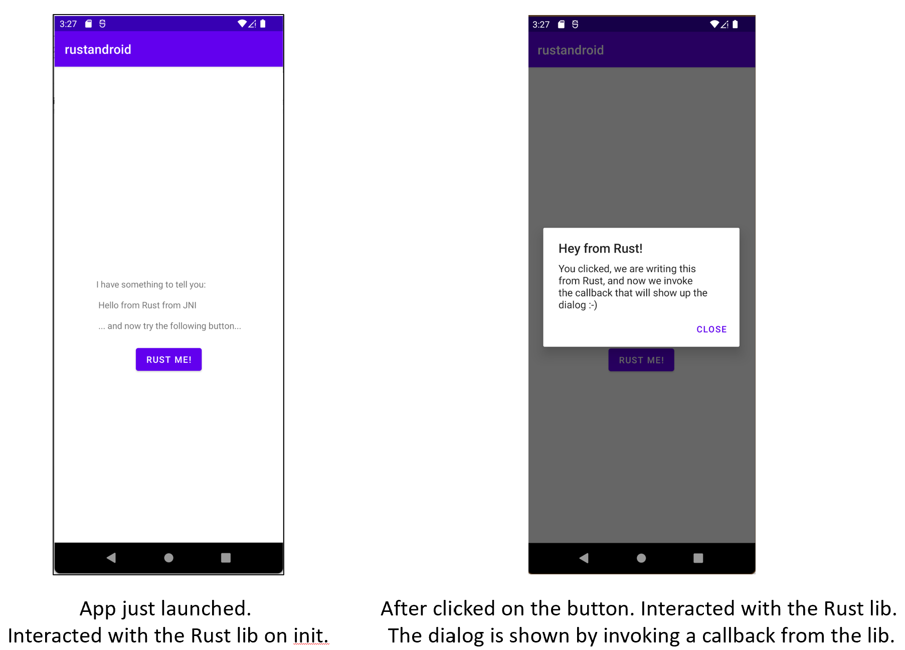

# rust-android-sample

This is a sample app that shows how we can use [Rust](https://www.rust-lang.org/) programming language to build shared code that can be used by Android apps.
This project is based in the [mozilla/rust-android-gradle plugin](https://github.com/mozilla/rust-android-gradle), specifically in its [app sample](https://github.com/mozilla/rust-android-gradle/tree/master/samples).

## What does this sample do?
In this sample we build a very small `Rust library` and a very simple `Kotlin Android app` that uses that library.
The app just call the Rust library and gets a result back using callback

## How to build and deploy?

1. Follow the [Get started](https://www.rust-lang.org/learn/get-started) section from the Rust main site.
2. Clone the repo, and open it in Android Studio.
3. Install all the specific **toolchains** that you will need/use. Find more info [here](https://github.com/mozilla/rust-android-gradle).
4. Click on build/deploy app. It should automatically build and deploy in an emulator/device.

If you are in Windows and you find some **issues** when building about **not able to find `lgcc`**, please, have a look to [this issue](https://github.com/mozilla/rust-android-gradle/issues/89). I followed [this hack](https://github.com/mozilla/rust-android-gradle/issues/89#issuecomment-1079862019) and it works. At least is good enough till this issue is fixed.

If you want just to create your own app using the `rust-android-gradle` plugin, follow its [README](https://github.com/mozilla/rust-android-gradle/blob/master/README.md) instructions.

## Useful resources

1. [Get started with Rust](https://www.rust-lang.org/learn/get-started).
2. [Rust language reference](https://doc.rust-lang.org/reference/introduction.html).
3. [Building and deploying a Rust library on Android](https://mozilla.github.io/firefox-browser-architecture/experiments/2017-09-21-rust-on-android.html).
4. [Rust on Android](https://medium.com/visly/rust-on-android-19f34a2fb43) + its [sample code](https://github.com/vislyhq/rust-android-example/tree/master/android).
5. [Rust-Android-Gradle plugin](https://github.com/mozilla/rust-android-gradle) and its [samples](https://github.com/mozilla/rust-android-gradle/tree/master/samples).
6. [Crate JNI](https://docs.rs/jni/latest/jni/) (note: as writing this latest is `0.19.0`).
7. [The Manifest format](https://doc.rust-lang.org/cargo/reference/manifest.html).
8. If you found issues when using `NDK >= 23`, please check [this](https://github.com/rust-lang/rust/pull/85806).
9. How to fix `NDK is not installed` issue. Please, [read this](https://nkaushik.com/android/fix-ndk-not-installed-error/#:~:text=%20How%20to%20fix%20NDK%20is%20not%20installed,in%20build.gradle%3A.%20Once%20the%20NDK%20is...%20More%20).
10. If you find issues when using `NDK >- 23` on `Windows` complaining about not finding `lgcc` library, please, [read this](https://github.com/mozilla/rust-android-gradle/issues/89).

## Code of Conduct

This project has adopted the [Microsoft Open Source Code of Conduct](https://opensource.microsoft.com/codeofconduct/). For more information see the [Code of Conduct FAQ](https://opensource.microsoft.com/codeofconduct/faq/) or contact [opencode@microsoft.com](mailto:opencode@microsoft.com) with any additional questions or comments.

## License

Based in [rust-android-gradle](https://github.com/mozilla/rust-android-gradle) plugin samples under **[Apache License v2](https://github.com/mozilla/rust-android-gradle/blob/master/LICENSE)**.